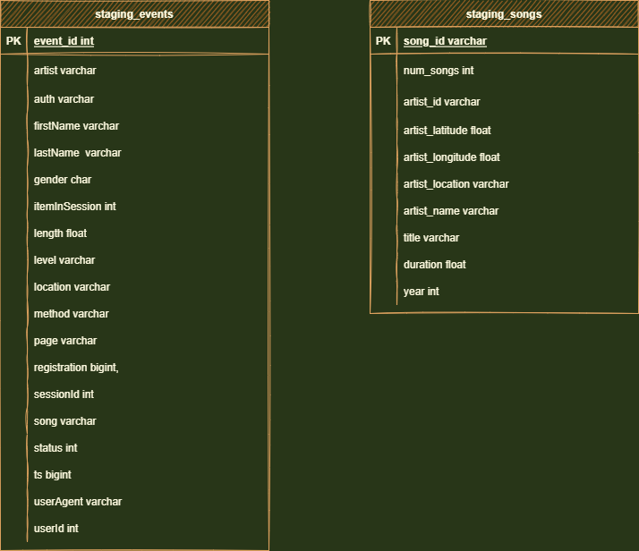

# Project: Data Warehouse


## **Table of Content** 
- [Project Introduction](#project-introduction)
- [Project Description](#project-description)
- [Prerequisites](#prerequisites)
  - [Packages Installation](#packages-installation)
    - [psycopg2-binary installation](#psycopg2-binary-installation)
    - [pandas installation](#pandas-installation)
- [Database Schema](#database-schema)
  - [Entity Relational Diagram (ERD)](#entity-relational-diagram-erd)

- [Project structure](#project-structure)
- [Build ETL Pipeline](#build-etl-pipeline)
- [Author](#author)

<br/><br/>

# Project Introduction
A music streaming startup, Sparkify, has grown their user base and song database and want to move their processes and data onto the cloud. Their data resides in S3, in a directory of JSON logs on user activity on the app, as well as a directory with JSON metadata on the songs in their app.

As their data engineer, you are tasked with building an ETL pipeline that extracts their data from S3, stages them in Redshift, and transforms data into a set of dimensional tables for their analytics team to continue finding insights into what songs their users are listening to. You'll be able to test your database and ETL pipeline by running queries given to you by the analytics team from Sparkify and compare your results with their expected results.
<br/><br/>

# Project Description
In this project, you'll apply what you've learned on data warehouses and AWS to build an ETL pipeline for a database hosted on Redshift. To complete the project, you will need to load data from S3 to staging tables on Redshift and execute SQL statements that create the analytics tables from these staging tables.
<br/><br/>

# Prerequisites
To work on this project you will need the following libraries:
- pandas
- psycopg2

## Packages Installation
### psycopg2-binary installation
Psycopg is the most popular PostgreSQL database adapter for the Python programming language.
[ref: https://pypi.org/project/psycopg2-binary/]
  ```bash
  pip install psycopg2-binary 
  ```
### pandas installation
pandas is a Python package that provides fast, flexible, and expressive data structures designed to make working with "relational" or "labeled" data both easy and intuitive. It aims to be the fundamental high-level building block for doing practical, real world data analysis in Python.
[ref: https://pypi.org/project/pandas/]
  ```bash
  pip install pandas
  ```
<br/><br/>

# DWH Configurations and setup:

* `dwh.cfg` Contains configuration data needed to connect to S3 and redshift database. Syntax as follows:

<br>

    [CLUSTER]
    HOST=
    DB_NAME=
    DB_USER=
    DB_PASSWORD=
    DB_PORT=

    [IAM_ROLE]
    ARN=

    [S3]
    LOG_DATA=
    LOG_JSONPATH=
    SONG_DATA=

<br/>
Configuration steps: 

* Create a new `IAM user` in your AWS account
* Give it AdministratorAccess and Attach policies
* Take note of the access key and secret
N(ARN)` and
you will also find `DB_NAME`, `DB_USER`, `DB_PASSWORD`, `DB_PORT` on this notebook. Then fill the config file `dwh.cfg` of this project with these information.
* `LOG_DATA`, `LOG_JSONPATH` and `SONG_DATA` you find out 
that they are already configured.
I did use this exercice ` L3 Exercise 2 - IaC` notebook to :

* First Edit the file dwh.cfg on this notebook 
(add the access key and secret).

* Create clients for `EC2`, `S3`, `IAM`, and `Redshift`
* Create an `IAM Role` that makes `Redshift` able to access `S3 bucket` (ReadOnly)
* Create a `RedShift Cluster` and get the `DWH_ENDPOINT(Host)` and `DWH_ROLE_AR


# Database Schema

The schema used for this project is the Star Schema: 

Star Schema: A star schema is used to denormalize business data into dimensions (like time and product) and facts (like transactions in amounts and quantities).
[ref: https://www.databricks.com/glossary/star-schema]

Fact table containing all the measures associated with each event *songplays*.

Dimension tables *songs*, *artists*, *users* and *time*, each with a primary key that is being referenced from the fact table.
<br/><br/>

## Entity Relational Diagram (ERD)


<br/><br/>

* Also we have two staging tables `staging_events` and `staging_songs`.


<br/><br/>

# Project structure
Files used on the project:
1. **create_table.py** is where you'll create your fact and dimension tables for the star schema in Redshift.
2. **etl.py** is where you'll load data from S3 into staging tables on Redshift and then process that data into your analytics tables on Redshift.
3. **sql_queries.py** is where you'll define you SQL statements, which will be imported into the two other files above.
4. **README.md** is where you'll provide discussion on your process and decisions for this ETL pipeline.


<br/><br/>


#  Build ETL Pipeline

1. Implement the logic in `etl.py` to load data from S3 to staging tables on Redshift.
2. Implement the logic in `etl.py` to load data from staging tables to analytics tables on Redshift.
3. Test by running `etl.py after running create_tables.py and running the analytic queries on your Redshift database to compare your results with the expected results.
4. Delete your redshift cluster when finished.


<br/><br/>

# How to Use

1. First you need to run the `create_tables.py` script from terminal to set up the database and tables that you will need in this project.
2. Run `etl.py` from terminal to process and load data into the database tables that we created during the first step.
3. Launch `test.ipynb` to run some select queries to see a sample of data stored in the created tables and other data validation queries.
**Note:** `sql_queries.py` this scripts has all the queries needed for both create/drop operations for the database as well as a query to retrieve song_id and artist_id from other tables.
<br/><br/>


# Author 
 [Marwen Hmidi](https://www.linkedin.com/in/hmidimarwen/) - Data Engineer