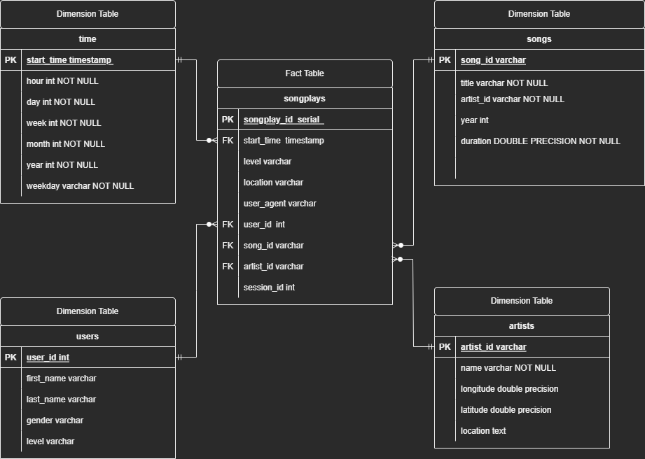

# Project: Data Lake With Spark


## **Table of Content** 
- [Project Introduction](#project-introduction)
- [Project Description](#project-description)
- [Project structure](#projectstructure)
  - [Configuration](#configuration)
- [Database Schema](#database-schema)
  - [Entity Relational Diagram (ERD)](#entity-relational-diagram-erd)


- [Author](#author)

<br/><br/>

# Project Introduction
A music streaming startup, Sparkify, has grown their user base and song database even more and want to move their data warehouse to a data lake. Their data resides in S3, in a directory of JSON logs on user activity on the app, as well as a directory with JSON metadata on the songs in their app.

As their data engineer, you are tasked with building an ETL pipeline that extracts their data from S3, processes them using Spark, and loads the data back into S3 as a set of dimensional tables. This will allow their analytics team to continue finding insights in what songs their users are listening to.

You'll be able to test your database and ETL pipeline by running queries given to you by the analytics team from Sparkify and compare your results with their expected results.
<br/><br/>

# Project Description
In this project, you'll apply what you've learned on Spark and data lakes to build an ETL pipeline for a data lake hosted on S3. To complete the project, you will need to load data from S3, process the data into analytics tables using Spark, and load them back into S3. You'll deploy this Spark process on a cluster using AWS.
<br/><br/>


# Project structure
In addition to the data files, the project workspace includes 5 files:

**1. dl.cfg**                    Contains the Secret Key for ASW access<br>
**3. etl.py**                    reads data from S3, processes that data using Spark, and writes them back to S3<br>
**5. README.md**                 is where you'll provide discussion on your process and decisions for this ETL pipeline.<br>

## Configuration

Remember to set `AWS_ACCESS_KEY_ID` and `AWS_SECRET_ACCESS_KEY` in **./aws/dl.cfg** before run **etl.py**<br>

* `dl.cfg` contains your AWS credentials. Syntax as follows:

<br>

    [AWS]
    AWS_ACCESS_KEY_ID = 
    AWS_SECRET_ACCESS_KEY =

<br/><br/>


## Project Datasets

### Song Dataset

The first dataset is a subset of real data from the [Million Song Dataset](http://millionsongdataset.com/).
Each file is in JSON format and contains metadata about a song and the artist of that song. 

The files are partitioned by the first three letters of each song's track ID. For example, here are filepaths to two files in this dataset.

>**s3://udacity-dend/song_data/A/B/C/TRABCEI128F424C983.json**<br>
>**s3://udacity-dend/song_data/A/A/B/TRAABJL12903CDCF1A.json**

Below is an example of what a single song file, **TRAABJL12903CDCF1A.json**, looks like.<br>
```
{"num_songs": 1,
"artist_id": "ARJIE2Y1187B994AB7", 
"artist_latitude": null,
"artist_longitude": null,
"artist_location": "",
"artist_name": "Line Renaud",
"song_id": "SOUPIRU12A6D4FA1E1",
"title": "Der Kleine Dompfaff",
"duration": 152.92036,
"year": 0}
```
### Log Dataset

The second dataset consists of log files in JSON format generated by this [event simulator](https://github.com/Interana/eventsim) based on the songs in the dataset above. These simulate activity logs from a music streaming app based on specified configurations.

The log files in the dataset are partitioned by year and month. For example, here are filepaths to two files in this dataset.

>**s3://udacity-dend/log_data/2018/11/2018-11-12-events.json**<br>
>**s3://udacity-dend/log_data/2018/11/2018-11-13-events.json**

And below is an example of what the data in a log file, **2018-11-12-events.json**, looks like.


## <br>Data Lake to store extracted dimentional tables
>**"s3a://udacity-dend-sparkify-output/artists"**<br>
>**"s3a://udacity-dend-sparkify-output/songs"**<br>
>**"s3a://udacity-dend-sparkify-output/time"**<br>
>**"s3a://udacity-dend-sparkify-output/users"** <br>
>**"s3a://udacity-dend-sparkify-output/songplays"**<br>


# Database Schema

The schema used for this project is the Star Schema: 

Star Schema: A star schema is used to denormalize business data into dimensions (like time and product) and facts (like transactions in amounts and quantities).
[ref: https://www.databricks.com/glossary/star-schema]

Fact table containing all the measures associated with each event *songplays*.

Dimension tables *songs*, *artists*, *users* and *time*, each with a primary key that is being referenced from the fact table.
<br/><br/>

## Entity Relational Diagram (ERD)


<br/><br/>


# Author 
 [Marwen Hmidi](https://www.linkedin.com/in/hmidimarwen/) - Data Engineer