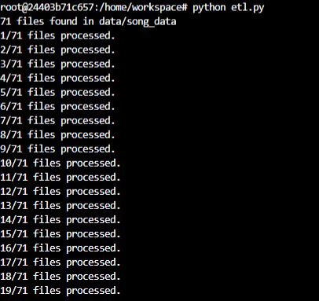

# Data Modeling with Postgres


## **Table of Content** 
- [Project Introduction](#project-introduction)
- [Project Description](#project-description)
- [Prerequisites](#prerequisites)
  - [Packages Installation](#packages-installation)
    - [psycopg2-binary installation](#psycopg2-binary-installation)
    - [ipython-sql installation](#ipython-sql-installation)
    - [pandas installation](#pandas-installation)
- [Database Schema](#database-schema)
  - [Entity Relational Diagram (ERD)](#entity-relational-diagram-erd)

- [Project structure](#project-structure)
- [ETL Pipeline](#etl-pipeline)
- [How to Use](#how-to-use)
- [Author](#author)

<br/><br/>

# Project Introduction
A startup called Sparkify wants to analyze the data they've been collecting on songs and user activity on their new music streaming app. The analytics team is particularly interested in understanding what songs users are listening to. Currently, they don't have an easy way to query their data, which resides in a directory of JSON logs on user activity on the app, as well as a directory with JSON metadata on the songs in their app.

They'd like a data engineer to create a Postgres database with tables designed to optimize queries on song play analysis, and bring you on the project. Your role is to create a database schema and ETL pipeline for this analysis. You'll be able to test your database and ETL pipeline by running queries given to you by the analytics team from Sparkify and compare your results with their expected results.
<br/><br/>

# Project Description
In this project, you'll apply what you've learned on data modeling with Postgres and build an ETL pipeline using Python. To complete the project, you will need to define fact and dimension tables for a star schema for a particular analytic focus, and write an ETL pipeline that transfers data from files in two local directories into these tables in Postgres using Python and SQL.
<br/><br/>

# Prerequisites
To work on this project you will need the following libraries:
- pandas
- psycopg2
- ipython-sql

## Packages Installation
### psycopg2-binary installation
Psycopg is the most popular PostgreSQL database adapter for the Python programming language.
[ref: https://pypi.org/project/psycopg2-binary/]
  ```bash
  pip install psycopg2-binary 
  ```
### ipython-sql installation
ipython-sql introduces a %sql (or %%sql) magic.
[ref: https://pypi.org/project/ipython-sql/]
  ```bash
  pip install ipython-sql
  ```
### pandas installation
pandas is a Python package that provides fast, flexible, and expressive data structures designed to make working with "relational" or "labeled" data both easy and intuitive. It aims to be the fundamental high-level building block for doing practical, real world data analysis in Python.
[ref: https://pypi.org/project/pandas/]
  ```bash
  pip install pandas
  ```
<br/><br/>
# Database Schema

The schema used for this project is the Star Schema: 

Star Schema: A star schema is used to denormalize business data into dimensions (like time and product) and facts (like transactions in amounts and quantities).
[ref: https://www.databricks.com/glossary/star-schema]

Fact table containing all the measures associated with each event *songplays*.

Dimension tables *songs*, *artists*, *users* and *time*, each with a primary key that is being referenced from the fact table.
<br/><br/>

## Entity Relational Diagram (ERD)


<br/><br/>

# Project structure
Files used on the project:
1. **data** A folder where all needed files reside (json format).
2. **test.ipynb** displays the first few rows of each table to let you check your database.
3. **create_tables.py** drops and creates your tables. You run this file to reset your tables before each time you run your ETL scripts.
4. **etl.ipynb** reads and processes a single file from song_data and log_data and loads the data into your tables. This notebook contains detailed instructions on the ETL process for each of the tables. 
5. **etl.py** reads and processes files from song_data and log_data and loads them into your tables. You can fill this out based on your work in the ETL notebook.
6. **sql_queries.py** contains all your sql queries, and is imported into the last three files above.
7. **README.md** this file communicate important information about this project.

<br/><br/>


#  ETL Pipeline

ETL, which stands for extract, transform and load, is a data integration process that combines data from multiple data sources into a single, consistent data store that is loaded into a data warehouse or other target system.
[ref: https://www.ibm.com/cloud/learn/etl#:~:text=ETL%2C%20which%20stands%20for%20extract,warehouse%20or%20other%20target%20system.]


We need to do some data quality checks and work on data to clean and shape data.
This is some data quality checks and transformation steps that I have done during this project:
* Check if the data contain some duplications.
* Check if there's any null values on any column in this dataframe
* Convert from UNIX time to datetime format.

The etl.py script execution must shows a similar output as bellow:




<br/><br/>

# How to Use

1. First you need to run the `create_tables.py` script from terminal to set up the database and tables that you will need in this project.
2. Run `etl.py` from terminal to process and load data into the database tables that we created during the first step.
3. Launch `test.ipynb` to run some select queries to see a sample of data stored in the created tables and other data validation queries.
**Note:** `sql_queries.py` this scripts has all the queries needed for both create/drop operations for the database as well as a query to retrieve song_id and artist_id from other tables.
<br/><br/>

# Author 
 [Marwen Hmidi](https://www.linkedin.com/in/hmidimarwen/) - Data Engineer
